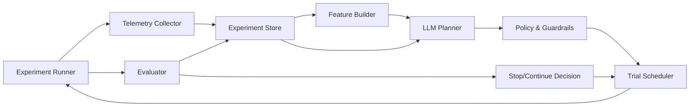

# 深度学习 LLM 自动调参架构蓝图

## 1. 目标定义
- 输入: 数据集、模型配置、硬件预算、历史实验日志。
- 输出: 可执行的下一轮实验方案（参数、训练策略、停止条件）和可解释决策理由。
- 约束: 安全可控、可回溯、可复现、可中止。

## 2. 分层架构


## 3. 模块职责
- `Experiment Runner`
  - 执行训练/验证任务，统一产出结构化日志。
- `Telemetry Collector`
  - 收集 loss 曲线、mAP、吞吐、显存、异常类型、耗时。
- `Experiment Store`
  - 保存实验参数、结果、标签（成功/失败/异常）和简要结论。
- `Feature Builder`
  - 将原始日志转换为 LLM 可消费摘要（趋势、拐点、异常片段）。
- `LLM Planner`
  - 基于历史检索 + 当前目标生成候选策略，不直接执行。
- `Policy & Guardrails`
  - 检查参数合法区间、变更幅度、预算限制、风险黑名单。
- `Trial Scheduler`
  - 负责试验排队、并发数控制、重试与回滚。
- `Evaluator`
  - 统一评估指标，给出统计显著性和“是否继续”判定。

## 4. 控制闭环（伪代码）
```text
init baseline
while budget_not_exceeded:
  summary = build_summary(last_k_trials, baseline, failures)
  plans = llm.plan(summary, constraints, target)
  plans = guardrail.filter(plans)
  trial = scheduler.pick(plans)
  result = runner.run(trial)
  store.write(trial, result)
  decision = evaluator.decide(result, baseline, patience, delta)
  if decision == STOP:
    break
  baseline = evaluator.update_baseline(baseline, result)
```

## 5. 关键设计原则
- 检索优先: LLM 必须先读历史实验，再生成方案，避免“随机炼丹”。
- 小步迭代: 单轮可调参数数量受限，优先低耦合变量。
- 强约束执行: 任何高风险参数变更都需通过 guardrail。
- 失败可学习: 异常实验必须结构化入库，供下一轮规避。
- 指标双阈值: 同时看主指标提升和稳定性指标，避免虚高。

## 6. 最小可落地数据结构
```json
{
  "trial_id": "T20260427_013",
  "model": "yolov8-gold.yaml",
  "params": {"lr0": 0.003, "mixup": 0.05, "freeze": 0},
  "metrics": {"map50": 0.931, "map50_95": 0.748, "loss_trend": "flat"},
  "runtime": {"gpu_mem_gb": 8.4, "epoch_time_s": 51},
  "status": "completed",
  "diagnosis": "no_gain_small_objects",
  "next_hint": "reduce augmentation noise + improve pretrain transfer"
}
```

## 7. 安全与工程基线
- 所有密钥走环境变量（如 `ARK_API_KEY`），禁止明文提交。
- 所有实验必须可复现（固定 seed、固定评估集、固定版本）。
- 默认启用失败快停（early stop + patience）。
- 强制保留“人类一票否决”机制。

## 8. 实施路径（建议）
- 阶段 1: 统一日志格式 + 实验数据库（先不引入 LLM）。
- 阶段 2: 引入检索增强摘要器（自动生成实验摘要）。
- 阶段 3: 接入 LLM Planner，仅给建议，不自动执行。
- 阶段 4: 开启受控自动执行（白名单参数 + 预算上限）。
- 阶段 5: 引入多目标决策（效果、稳定性、成本联合优化）。

## 9. 适用边界
- 适合: 调参空间大、日志丰富、试验成本可控的研究任务。
- 不适合: 数据极小且标签噪声高、基础实验协议尚未建立的任务。

